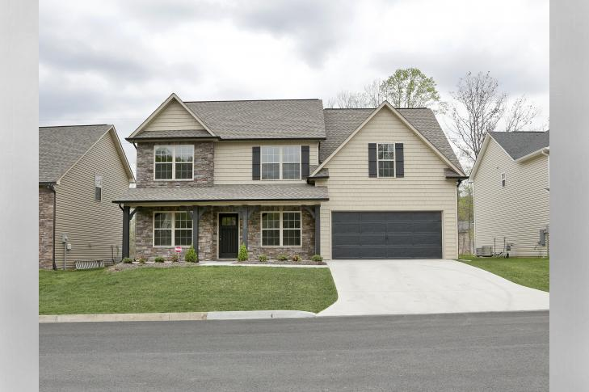

# ORNL House Project

This repository contains the notebooks for the full project I have been working the past two weeks using the ORNL sensor data. The ORNL house is a research house in Tennessee, USA that is loaded with various energy and weather sensors. Using the dataset found [here](https://openei.org/datasets/dataset/ornl-research-house-3), which contains 15 minute measurements of all sensors between Oct 2013 - Oct 2014,  I have worked on a full data science project that demonstrates how energy sensor data can be combined with weather data to predict energy consumption.

The applications of this are endless with three of the most important ones being :

1. Virtual Energy Audits

2. Examining energy profiles to determine energy saving potential

3. Complete automation of equipment scheduling using predictive models

# The Notebooks

If you can't access the notebooks, it is better if you use the following links to the nbviewer to be able to view the interractive graphs as well:

- [Part 1 : Data Cleaning Notebook](https://nbviewer.jupyter.org/github/Stratoshad/House_Energy_Project/blob/master/notebooks/ORNL%20Project%20Energy%20Efficiency%20Part%201%20-%20Data%20Importing%20and%20Cleaning.ipynb)

- [Part 2 : Data Manipulation / Feature Extraction](https://nbviewer.jupyter.org/github/Stratoshad/House_Energy_Project/blob/master/notebooks/ORNL%20Project%20Energy%20Efficiency%20Part%202%20-%20Data%20Manipulation%20and%20Feature%20Extraction.ipynb)

- [Part 3 : Exploratory Data Analysis (EDA)](https://nbviewer.jupyter.org/github/Stratoshad/House_Energy_Project/blob/master/notebooks/ORNL%20Project%20Energy%20Efficiency%20Part%203%20-%20Exploratory%20Data%20Analysis%20%28EDA%29.ipynb)

- [Part 4 : Building a Machine Learning Model](https://nbviewer.jupyter.org/github/Stratoshad/House_Energy_Project/blob/master/notebooks/ORNL%20Project%20Energy%20Efficiency%20Part%204%20-%20Machine%20Learning%20Modelling%20and%20Optimization.ipynb)
